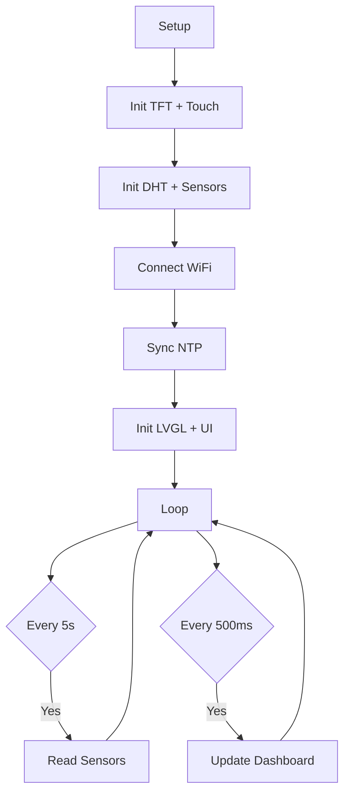

# Smart Plant System

Hệ thống giám sát và tưới cây tự động sử dụng ESP32 với màn hình TFT cảm ứng.

> [!info] Repository
> Source code: `smartPlant/smartPlant.ino`

## Phần cứng

### Cảm biến

| Cảm biến | GPIO | Chức năng |
|----------|------|-----------|
| DHT11 | 27 | Nhiệt độ + Độ ẩm không khí |
| Soil Moisture | 35 (ADC) | Độ ẩm đất |
| Rain Sensor | 34 (ADC) | Phát hiện mưa |

> [!tip] Hiệu chuẩn Soil Moisture
> - Dry = 4095 (đất khô)
> - Wet = 1200 (đất ướt)
> - Công thức: `map(raw, 4095, 1200, 0, 100)`

### Thiết bị đầu ra

| Thiết bị | GPIO | Ghi chú |
|----------|------|---------|
| Relay Đèn | 15 | Active-low |
| Relay Bơm | 2 | Active-low |

### Màn hình

- **ST7789 TFT** — 320x240 pixels
- **XPT2046 Touch** — Cảm ứng điện trở
- Rotation = 3 (landscape)

> [!tip] Cải thiện Touch
> - Thêm chân **T_IRQ: GPIO 33** để dùng interrupt thay vì polling
> - Hạ **Z_THRESHOLD = 20** để tăng độ nhạy với tay
> - Thêm **smoothing filter** (trung bình 4 lần đọc) để giảm jitter
> - Calibration: MIN_X=460, MAX_X=3591, MIN_Y=568, MAX_Y=3473

Xem thêm: [[ESP32 System.canvas]]

## Phần mềm

### Stack

- **Arduino IDE** với ESP32 Dev Module
- **LVGL v9.4** — UI framework
- **TFT_eSPI** — Display driver
- **EEZ Studio** — UI designer
- **WiFi + NTP** — Đồng hồ thời gian thực

### Luồng hoạt động



### Biến toàn cục (EEZ Studio)

| Biến | Kiểu | Mô tả |
|------|------|-------|
| `temperture_value` | int32 | Nhiệt độ (°C) |
| `humidity_value` | int32 | Độ ẩm (%) |
| `air_quality_value` | int32 | Độ ẩm đất (%) |
| `rain_percent` | int32 | Mưa (%) |
| `time_hour` | int32 | Giờ |
| `time_minute` | int32 | Phút |
| `date` | int32 | Ngày |
| `month` | string | Tháng |
| `dayof_week_var` | DayOfWeek | Thứ |

### Logic hiển thị

> [!example] Trạng thái đất
> - `>= 80%` → **Good**
> - `>= 50%` → **Fine**
> - `< 50%` → **Low**

> [!example] Thời tiết
> - `rain >= 30%` → Hiển thị icon mưa
> - `rain < 30%` → Hiển thị icon nắng

> [!example] Temperature Arc
> - Arc hiển thị nhiệt độ dạng nửa vòng tròn
> - Mapping: 0°C → 0, 50°C → 100, 26°C → 52
> - Background angle: 180° → 0° (nửa vòng trên)
> - Color: #26d100 (xanh lá)

> [!example] Switch Touch Area
> - Mở rộng vùng chạm 15px mỗi bên bằng `lv_obj_set_ext_click_area`
> - Light switch: vùng 231-311, 131-186
> - Pump switch: vùng 232-312, 175-230
> - Tắt clickable cho tất cả widget khác (chỉ giữ 2 switch)

## Pin Map

```
ESP32 GPIO  ───  Component
─────────────────────────
GPIO 27     ───  DHT11 DATA
GPIO 35     ───  Soil Moisture A0
GPIO 34     ───  Rain Sensor A0
GPIO 15     ───  Relay Light IN
GPIO 2      ───  Relay Pump IN
GPIO 32     ───  TFT Backlight
GPIO 17     ───  TFT CS
GPIO 16     ───  TFT DC
GPIO 5      ───  TFT RST
GPIO 23     ───  TFT/Touch MOSI
GPIO 18     ───  TFT/Touch SCLK
GPIO 19     ───  Touch MISO
GPIO 21     ───  Touch CS
GPIO 33     ───  Touch T_IRQ
```

## Tài liệu tham khảo

- [[Task Tracker.base]]
- [[Reading List.base]]
- [[Dashboard.base]]
- [[Smart Plant Tracker.base]]

## Project Tracker

![[Smart Plant Tracker.base]]

## Nhật ký phát triển

> [!note] 2026-05-14
> - Hoàn thiện UI dashboard
> - Fix touch calibration
> - Tạo Obsidian vault

> [!note] 2026-05-15
> - Thêm arc hiển thị nhiệt độ (0-50°C → 0-100)
> - Thêm T_IRQ (GPIO 33) cho touch interrupt
> - Hạ Z_THRESHOLD xuống 20 để tăng độ nhạy
> - Thêm smoothing filter cho touch coordinates
> - Mở rộng vùng chạm switch (+15px mỗi bên)
> - Tắt clickable cho tất cả widget trừ switch

> [!warning] Lưu ý
> SPI frequency phải đặt 27MHz để tránh lỗi màn hình trắng.
