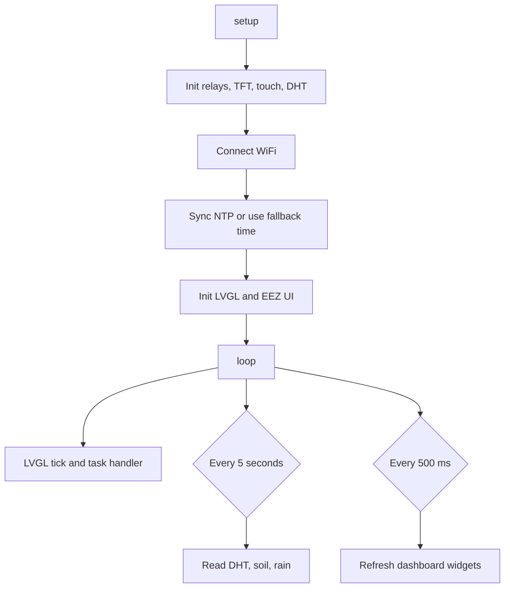

# Smart Plant System

Smart Plant System is an ESP32-based monitoring and watering dashboard for a small plant setup. It combines a 320x240 ST7789 TFT display, XPT2046 resistive touch, LVGL v9.4, EEZ Studio generated UI files, and Arduino sensor code for temperature, humidity, soil moisture, rain detection, light control, and pump control.

This repository also contains the Obsidian vault used to plan and document the project. The `.obsidian` folder, Bases, Canvas diagrams, tasks, books, and daily notes are included so the hardware notes and code history stay together.

## Main Features

- ESP32 Dev Module firmware built with Arduino IDE.
- ST7789 TFT dashboard in landscape mode using TFT_eSPI and LVGL.
- XPT2046 touch input for relay switches.
- DHT11 temperature and humidity readings.
- Soil moisture reading on ADC GPIO 35 with dry/wet calibration.
- Rain sensor reading on ADC GPIO 34 with rain/sun UI status.
- Active-low relay outputs for light and pump control.
- WiFi + NTP time sync for GMT+7 Vietnam time.
- Obsidian project management with `.base` trackers and `.canvas` diagrams.

## Repository Layout

| Path | Purpose |
| --- | --- |
| `.obsidian/` | Obsidian vault settings and Homepage community plugin files. |
| `Cay-trong-thong-minh/Smart Plant System.md` | Main project note with wiring, software flow, pin map, and development notes. |
| `Cay-trong-thong-minh/Bases/` | Obsidian Bases and Canvas diagrams for project tracking. |
| `Cay-trong-thong-minh/smartPlant/` | Main smart plant Arduino sketch and EEZ/LVGL generated UI source. |
| `Cay-trong-thong-minh/ui/` | EEZ Studio generated UI export/reference files. |
| `Cay-trong-thong-minh/kartis_smart_home_v1-main/` | Earlier smart home dashboard sketches and touch calibration tools. |
| `Cay-trong-thong-minh/DHT_Test/` | Standalone DHT sensor test sketch. |
| `Cay-trong-thong-minh/NeoPixel_Test/` | Standalone NeoPixel test sketch. |
| `lv_conf.h` | Reference LVGL config copy. Arduino uses the copy in the LVGL library folder. |
| `User_Setup.h` | Reference TFT_eSPI config copy. Arduino uses the copy in the TFT_eSPI library folder. |

## Hardware Pin Map

| Component | GPIO | Notes |
| --- | --- | --- |
| DHT11 DATA | 27 | Temperature and air humidity. |
| Soil Moisture A0 | 35 | ADC input, dry = 4095, wet = 1200. |
| Rain Sensor A0 | 34 | ADC input mapped to 0-100%. |
| Relay Light IN | 15 | Active-low relay output. |
| Relay Pump IN | 2 | Active-low relay output. |
| TFT Backlight | 32 | Driven high in setup. |
| TFT CS | 17 | ST7789 chip select. |
| TFT DC | 16 | ST7789 data/command. |
| TFT RST | 5 | ST7789 reset. |
| TFT/Touch MOSI | 23 | Shared SPI MOSI. |
| TFT/Touch SCLK | 18 | Shared SPI clock. |
| Touch MISO | 19 | XPT2046 MISO. |
| Touch CS | 21 | XPT2046 chip select. |

## Arduino Setup

1. Install Arduino IDE and the ESP32 board package.
2. Select `ESP32 Dev Module`.
3. Use upload speed `115200` if higher speeds fail.
4. Install these libraries:
   - TFT_eSPI by Bodmer
   - LVGL v9.4.x
   - XPT2046_Touchscreen by Paul Stoffregen
   - DHT sensor library by Adafruit
5. Copy `Cay-trong-thong-minh/smartPlant/secrets.example.h` to `Cay-trong-thong-minh/smartPlant/secrets.h`.
6. Fill in `WIFI_SSID` and `WIFI_PASSWORD` in `secrets.h`.
7. Open `Cay-trong-thong-minh/smartPlant/smartPlant.ino` and upload it.

`secrets.h` is ignored by git so WiFi credentials do not get committed.

## Required Display Configuration

TFT_eSPI reads its configuration from the installed library folder, not from this repository. On the local Windows setup this is typically:

```text
C:\Users\HuyVo\Documents\Arduino\libraries\TFT_eSPI\User_Setup.h
```

Important values:

```c
#define ST7789_DRIVER
#define TFT_WIDTH  240
#define TFT_HEIGHT 320
#define TFT_RGB_ORDER TFT_BGR
#define SPI_FREQUENCY 27000000
#define TFT_CS   17
#define TFT_DC   16
#define TFT_RST   5
#define TOUCH_CS 21
```

LVGL also reads `lv_conf.h` from the library-side location. Enable LVGL with `#if 1`, use `LV_COLOR_DEPTH 16`, and keep the fonts used by the EEZ Studio UI enabled.

## Smart Plant Firmware Flow



## Obsidian Vault

Open the repository root as an Obsidian vault to use the included `.obsidian` configuration. Useful files:

- `Cay-trong-thong-minh/Smart Plant System.md`: primary system documentation.
- `Cay-trong-thong-minh/Bases/Smart Plant.canvas`: hardware and data-flow diagram.
- `Cay-trong-thong-minh/Bases/Smart Plant Tracker.base`: project status view.
- `Cay-trong-thong-minh/Bases/Task Tracker.base`: task list grouped by status.
- `Cay-trong-thong-minh/Bases/Reading List.base`: project reading list.
- `Cay-trong-thong-minh/Bases/Dashboard.base`: combined notes dashboard.

## Troubleshooting

- White screen: confirm ST7789 is selected, pins match, and SPI frequency is 27 MHz.
- Wrong colors: try toggling `TFT_RGB_ORDER` and TFT inversion settings.
- Upload fails: hold BOOT during the Arduino IDE "Connecting..." phase.
- DHT read fails: check DATA on GPIO 27 and add a 4.7k pull-up between DATA and VCC.
- Touch is offset: run the calibration sketch under `kartis_smart_home_v1-main`.

## Project Status

The main smart plant firmware is active and located in `Cay-trong-thong-minh/smartPlant`. The repository also keeps earlier smart home/dashboard experiments for reference.
