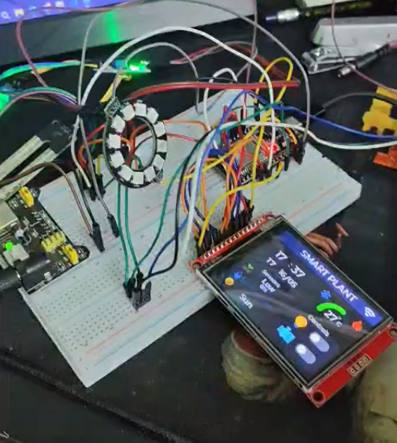
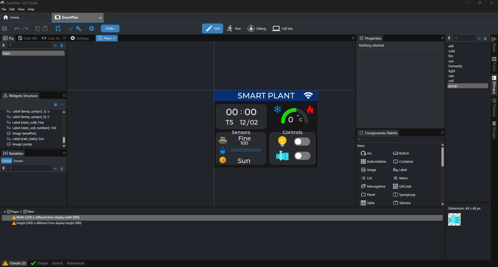
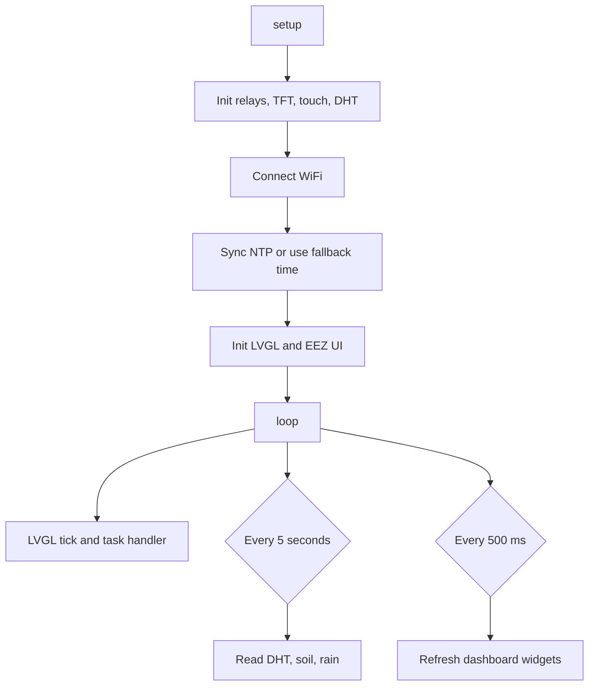

<h1 align="center">Smart Plant System</h1>

<p align="center">
  ESP32 smart plant dashboard with ST7789 touch display, LVGL UI, DHT11, soil moisture, rain sensing, relay light control, relay pump control, and an Obsidian project vault.
</p>

<p align="center">
  <a href="docs/README.vi.md">Tiếng Việt</a>
</p>

<p align="center">
  
  
  
  
  
</p>

<p align="center">
  <a href="#showcase">Showcase</a>
  ·
  <a href="#features">Features</a>
  ·
  <a href="#quick-start">Quick Start</a>
  ·
  <a href="#required-display-configuration">Display Config</a>
  ·
  <a href="#project-layout">Project Layout</a>
  ·
  <a href="#troubleshooting">Troubleshooting</a>
</p>

## Overview

Smart Plant System is a small ESP32 IoT project for monitoring and controlling a plant setup. The main firmware reads air temperature, air humidity, soil moisture, and rain level, then displays live values on a 320x240 TFT touch dashboard. Two on-screen switches control active-low relays for a light and a water pump.

The UI is generated with EEZ Studio and rendered through LVGL v9.4. Project notes, pin maps, tasks, reading references, and architecture diagrams are kept in the included Obsidian vault so the firmware and hardware documentation stay together.

## Showcase

| Hardware prototype | EEZ Studio UI |
| --- | --- |
|  |  |

The dashboard shows the current time, date, soil status, rain/sun status, temperature arc, and relay controls. The sketch refreshes sensor data every 5 seconds and updates dashboard widgets every 500 ms.

<div align="center">
  <video src="[https://github.com/user/repo/assets/xxx/video.mp4](https://github.com/user-attachments/assets/216a2a73-00a2-46a3-b486-1923e65aa5a5)" width="100%" style="max-width: 800px; border-radius: 8px; border: 1px solid #e1e4e8;" controls>
    Your browser does not support the video tag.
  </video>
</div>


## Features

| Area | What it does |
| --- | --- |
| Sensor monitoring | Reads DHT11 temperature/humidity, soil moisture, and rain sensor values. |
| Touch dashboard | Uses ST7789 + XPT2046 with LVGL and EEZ Studio generated UI files. |
| Relay control | Controls light and pump relays from UI switches. |
| Time sync | Uses WiFi + NTP for GMT+7 Vietnam time with fallback values if WiFi fails. |
| Plant status | Maps soil moisture and rain percentage into readable UI states. |
| Local credentials | Keeps WiFi SSID/password in ignored `secrets.h`, with `secrets.example.h` as the template. |
| Project vault | Includes Obsidian notes, Bases, Canvas diagrams, tasks, and reading references. |

## Hardware

| Component | GPIO | Notes |
| --- | --- | --- |
| DHT11 DATA | 27 | Temperature and air humidity. |
| Soil Moisture A0 | 35 | ADC input, dry = 4095, wet = 1200. |
| Rain Sensor A0 | 34 | ADC input mapped to 0-100%. |
| Relay Light IN | 15 | Active-low relay output. |
| Relay Pump IN | 2 | Active-low relay output. |
| TFT Backlight | 32 | Driven high in setup. |
| TFT CS | 17 | ST7789 chip select. |
| TFT DC | 16 | ST7789 data/command. |
| TFT RST | 5 | ST7789 reset. |
| TFT/Touch MOSI | 23 | Shared SPI MOSI. |
| TFT/Touch SCLK | 18 | Shared SPI clock. |
| Touch MISO | 19 | XPT2046 MISO. |
| Touch CS | 21 | XPT2046 chip select. |

## Quick Start

1. Clone the repository.

```powershell
git clone https://github.com/lehuyqq/Smart-Plant-System.git
cd Smart-Plant-System
```

2. Install Arduino IDE and the ESP32 board package.

3. Install required libraries from Arduino Library Manager:

| Library | Purpose |
| --- | --- |
| TFT_eSPI by Bodmer | ST7789 display driver. |
| LVGL v9.4.x | UI framework. |
| XPT2046_Touchscreen by Paul Stoffregen | Resistive touch input. |
| DHT sensor library by Adafruit | DHT11 readings. |

4. Copy the WiFi template and fill in your local credentials.

```powershell
Copy-Item .\Cay-trong-thong-minh\smartPlant\secrets.example.h .\Cay-trong-thong-minh\smartPlant\secrets.h
```

5. Open and upload the main firmware:

```text
Cay-trong-thong-minh/smartPlant/smartPlant.ino
```

Board settings:

| Setting | Value |
| --- | --- |
| Board | ESP32 Dev Module |
| Upload speed | 115200 |
| Display rotation | 3, landscape |
| Serial monitor | 115200 baud |

## Required Display Configuration

The repository includes reference configuration files:

```text
User_Setup.h
lv_conf.h
```

Arduino libraries do not read those files directly from the repository. Copy them into the installed Arduino library locations before compiling:

```powershell
Copy-Item .\User_Setup.h "$env:USERPROFILE\Documents\Arduino\libraries\TFT_eSPI\User_Setup.h" -Force
Copy-Item .\lv_conf.h "$env:USERPROFILE\Documents\Arduino\libraries\lv_conf.h" -Force
```

Important TFT_eSPI values:

```c
#define ST7789_DRIVER
#define TFT_WIDTH  240
#define TFT_HEIGHT 320
#define TFT_RGB_ORDER TFT_BGR
#define SPI_FREQUENCY 27000000
#define TFT_CS   17
#define TFT_DC   16
#define TFT_RST   5
#define TOUCH_CS 21
```

Important LVGL values:

```c
#if 1
#define LV_COLOR_DEPTH 16
```

Keep the fonts used by the EEZ Studio UI enabled in `lv_conf.h`.

## Firmware Flow



## Project Layout

```text
Smart-Plant-System/
  .obsidian/                         Obsidian vault settings
  docs/README.vi.md                  Vietnamese README
  docs/assets/                       Hardware and UI images
  Cay-trong-thong-minh/
    Smart Plant System.md            Main Obsidian project note
    Bases/                           Obsidian Bases and Canvas diagrams
    Books/                           Reading notes
    Tasks/                           Project task notes
    DHT_Test/                        Standalone DHT test sketch
    NeoPixel_Test/                   Standalone NeoPixel test sketch
    smartPlant/                      Main ESP32 smart plant firmware
    ui/                              EEZ Studio generated UI reference
  User_Setup.h                       TFT_eSPI config to copy into Arduino libraries
  lv_conf.h                          LVGL config to copy into Arduino libraries
```

## Obsidian Vault

Open the repository root as an Obsidian vault to use the included project notes.

Useful files:

| File | Purpose |
| --- | --- |
| `Cay-trong-thong-minh/Smart Plant System.md` | Main system documentation. |
| `Cay-trong-thong-minh/Bases/Smart Plant.canvas` | Hardware and data-flow diagram. |
| `Cay-trong-thong-minh/Bases/Smart Plant Tracker.base` | Project status view. |
| `Cay-trong-thong-minh/Bases/Task Tracker.base` | Task list grouped by status. |
| `Cay-trong-thong-minh/Bases/Reading List.base` | Reading list. |
| `Cay-trong-thong-minh/Bases/Dashboard.base` | Combined notes dashboard. |

## Troubleshooting

| Problem | Fix |
| --- | --- |
| White screen | Confirm ST7789 driver, wiring, and `SPI_FREQUENCY 27000000`. |
| Wrong colors | Toggle `TFT_RGB_ORDER` and TFT inversion settings in TFT_eSPI. |
| Upload fails | Hold BOOT while Arduino IDE shows "Connecting...". |
| DHT read fails | Check DATA on GPIO 27 and add a 4.7k pull-up between DATA and VCC. |
| Touch is offset | Recalibrate XPT2046 raw min/max values for the current display rotation. |
| WiFi/NTP fails | Check `smartPlant/secrets.h`; firmware falls back to static time values if WiFi is unavailable. |

## Security

Never commit `secrets.h`, WiFi credentials, generated build outputs, or local Arduino cache folders. Use `secrets.example.h` as the public template and keep private values only on your machine.

## License

No license file has been added yet. Add one before redistributing the project outside personal or classroom use.
