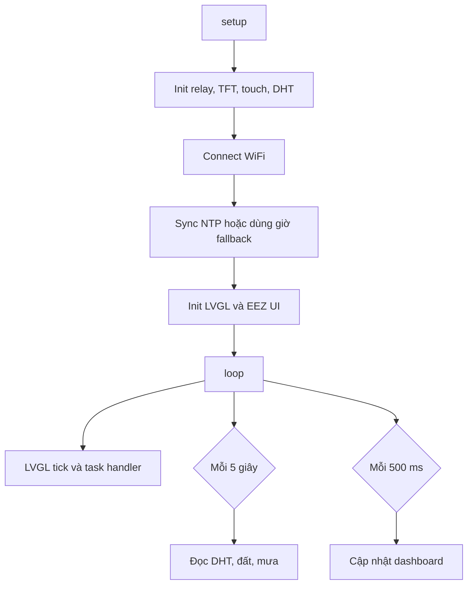

<h1 align="center">Smart Plant System</h1>

<p align="center">
  Hệ thống cây thông minh dùng ESP32, màn hình cảm ứng ST7789, LVGL, DHT11, cảm biến độ ẩm đất, cảm biến mưa, relay điều khiển đèn/bơm và vault Obsidian để ghi chú dự án.
</p>

<p align="center">
  <a href="../README.md">English</a>
</p>

## Tổng quan

Smart Plant System là dự án IoT nhỏ cho ESP32 dùng để theo dõi và điều khiển mô hình chăm sóc cây. Firmware chính đọc nhiệt độ, độ ẩm không khí, độ ẩm đất và lượng mưa, sau đó hiển thị dữ liệu trên dashboard TFT 320x240. Hai công tắc cảm ứng trên giao diện điều khiển relay đèn và relay bơm.

Giao diện được thiết kế bằng EEZ Studio và render bằng LVGL v9.4. Repo cũng chứa vault Obsidian gồm ghi chú, pin map, task, tài liệu đọc và canvas sơ đồ hệ thống.

## Demo

| Mô hình phần cứng | Giao diện EEZ Studio |
| --- | --- |
|  |  |

Video demo:

```text
https://drive.google.com/file/d/18nuQyn8GsqG1Ad74C0_Dn59zHAqQSAOb/view?usp=sharing
```

## Tính năng

| Nhóm | Mô tả |
| --- | --- |
| Đọc cảm biến | DHT11, độ ẩm đất và cảm biến mưa. |
| Dashboard cảm ứng | ST7789 + XPT2046 với LVGL và UI sinh từ EEZ Studio. |
| Điều khiển relay | Bật/tắt đèn và bơm từ công tắc trên màn hình. |
| Đồng bộ thời gian | WiFi + NTP theo múi giờ GMT+7 Việt Nam. |
| Trạng thái cây | Chuyển độ ẩm đất và lượng mưa thành trạng thái dễ đọc trên UI. |
| Bảo mật WiFi | Lưu SSID/mật khẩu trong `secrets.h`, file này không được commit. |
| Ghi chú dự án | Obsidian Bases, Canvas, task và reading notes. |

## Phần cứng

| Linh kiện | GPIO | Ghi chú |
| --- | --- | --- |
| DHT11 DATA | 27 | Nhiệt độ và độ ẩm không khí. |
| Soil Moisture A0 | 35 | ADC, khô = 4095, ướt = 1200. |
| Rain Sensor A0 | 34 | ADC, map về 0-100%. |
| Relay đèn IN | 15 | Relay active-low. |
| Relay bơm IN | 2 | Relay active-low. |
| TFT Backlight | 32 | Kéo HIGH trong `setup()`. |
| TFT CS | 17 | Chip select ST7789. |
| TFT DC | 16 | Data/command ST7789. |
| TFT RST | 5 | Reset ST7789. |
| TFT/Touch MOSI | 23 | SPI MOSI dùng chung. |
| TFT/Touch SCLK | 18 | SPI clock dùng chung. |
| Touch MISO | 19 | XPT2046 MISO. |
| Touch CS | 21 | Chip select XPT2046. |

## Cài đặt nhanh

1. Clone repo.

```powershell
git clone https://github.com/lehuyqq/Smart-Plant-System.git
cd Smart-Plant-System
```

2. Cài Arduino IDE và ESP32 board package.

3. Cài thư viện trong Arduino Library Manager:

| Thư viện | Chức năng |
| --- | --- |
| TFT_eSPI by Bodmer | Driver màn hình ST7789. |
| LVGL v9.4.x | Framework giao diện. |
| XPT2046_Touchscreen by Paul Stoffregen | Cảm ứng điện trở. |
| DHT sensor library by Adafruit | Đọc DHT11. |

4. Tạo file WiFi local từ file mẫu.

```powershell
Copy-Item .\Cay-trong-thong-minh\smartPlant\secrets.example.h .\Cay-trong-thong-minh\smartPlant\secrets.h
```

5. Điền `WIFI_SSID` và `WIFI_PASSWORD` trong `secrets.h`.

6. Mở và upload firmware:

```text
Cay-trong-thong-minh/smartPlant/smartPlant.ino
```

Thông số board:

| Thiết lập | Giá trị |
| --- | --- |
| Board | ESP32 Dev Module |
| Upload speed | 115200 |
| Display rotation | 3, landscape |
| Serial monitor | 115200 baud |

## Cấu hình màn hình bắt buộc

Repo có sẵn hai file cấu hình mẫu:

```text
User_Setup.h
lv_conf.h
```

Arduino không đọc trực tiếp hai file này từ repo. Hãy copy chúng vào thư mục thư viện Arduino trước khi build:

```powershell
Copy-Item .\User_Setup.h "$env:USERPROFILE\Documents\Arduino\libraries\TFT_eSPI\User_Setup.h" -Force
Copy-Item .\lv_conf.h "$env:USERPROFILE\Documents\Arduino\libraries\lv_conf.h" -Force
```

Giá trị TFT_eSPI quan trọng:

```c
#define ST7789_DRIVER
#define TFT_WIDTH  240
#define TFT_HEIGHT 320
#define TFT_RGB_ORDER TFT_BGR
#define SPI_FREQUENCY 27000000
#define TFT_CS   17
#define TFT_DC   16
#define TFT_RST   5
#define TOUCH_CS 21
```

Giá trị LVGL quan trọng:

```c
#if 1
#define LV_COLOR_DEPTH 16
```

Giữ bật các font mà UI EEZ Studio đang dùng trong `lv_conf.h`.

## Luồng firmware



## Cấu trúc repo

```text
Smart-Plant-System/
  .obsidian/                         Cấu hình vault Obsidian
  docs/README.vi.md                  README tiếng Việt
  docs/assets/                       Ảnh phần cứng và ảnh UI
  Cay-trong-thong-minh/
    Smart Plant System.md            Ghi chú chính của dự án
    Bases/                           Obsidian Bases và Canvas
    Books/                           Ghi chú tài liệu đọc
    Tasks/                           Task dự án
    DHT_Test/                        Sketch test DHT
    NeoPixel_Test/                   Sketch test NeoPixel
    smartPlant/                      Firmware chính ESP32
    ui/                              UI sinh từ EEZ Studio để tham khảo
  User_Setup.h                       Cấu hình TFT_eSPI để copy vào Arduino libraries
  lv_conf.h                          Cấu hình LVGL để copy vào Arduino libraries
```

## Obsidian Vault

Mở root repo bằng Obsidian để dùng các ghi chú dự án.

| File | Chức năng |
| --- | --- |
| `Cay-trong-thong-minh/Smart Plant System.md` | Tài liệu hệ thống chính. |
| `Cay-trong-thong-minh/Bases/Smart Plant.canvas` | Sơ đồ phần cứng và luồng dữ liệu. |
| `Cay-trong-thong-minh/Bases/Smart Plant Tracker.base` | Theo dõi trạng thái dự án. |
| `Cay-trong-thong-minh/Bases/Task Tracker.base` | Theo dõi task theo trạng thái. |
| `Cay-trong-thong-minh/Bases/Reading List.base` | Danh sách tài liệu đọc. |
| `Cay-trong-thong-minh/Bases/Dashboard.base` | Dashboard tổng hợp ghi chú. |

## Sửa lỗi nhanh

| Lỗi | Cách xử lý |
| --- | --- |
| Màn hình trắng | Kiểm tra driver ST7789, dây nối và `SPI_FREQUENCY 27000000`. |
| Sai màu | Thử đổi `TFT_RGB_ORDER` và setting inversion trong TFT_eSPI. |
| Không upload được | Giữ nút BOOT khi Arduino IDE hiện "Connecting...". |
| DHT đọc lỗi | Kiểm tra DATA ở GPIO 27 và thêm điện trở kéo lên 4.7k giữa DATA và VCC. |
| Touch lệch | Hiệu chuẩn lại raw min/max cho XPT2046 theo rotation đang dùng. |
| WiFi/NTP lỗi | Kiểm tra `smartPlant/secrets.h`; firmware sẽ dùng giờ fallback nếu WiFi không kết nối. |

## Bảo mật

Không commit `secrets.h`, mật khẩu WiFi, build output hoặc cache Arduino local. Chỉ commit `secrets.example.h` làm mẫu public.
